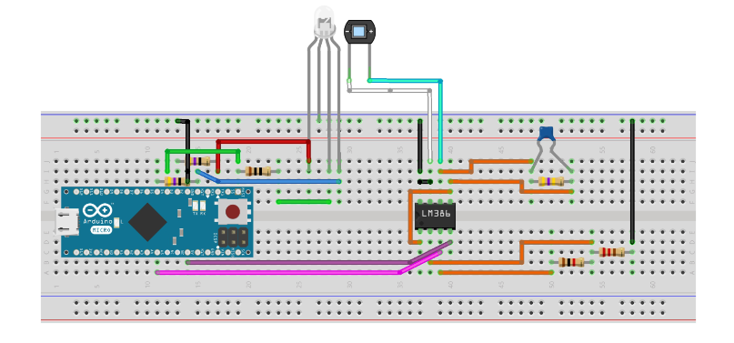

# ColorSensor
Group project with the purpose of designing and building a device that can detect the colors of the surface on which it is placed.

https://github.com/masal-98/ColorSensor/blob/3f54e840d07387da64b9230f426652766ade9c57/Color%20sensor%20images/principle.PNG)

